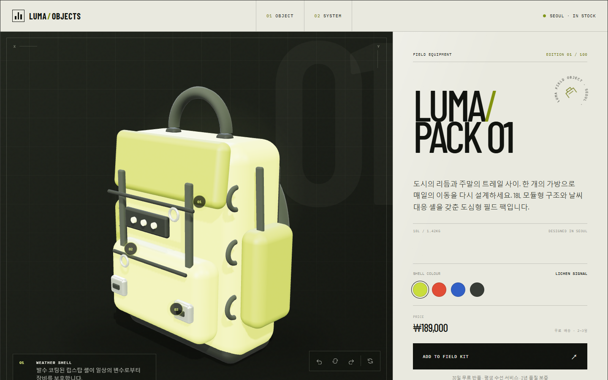

# LumaPack 01 — 3D Product Customizer

Three.js로 제작한 모듈형 백팩 3D 제품 상세 페이지입니다. 사용자는 마우스 또는 터치로 제품을 360도로 살펴보고, 네 가지 셸 컬러를 비교하고, 45도 단위 회전과 자동 회전을 실행할 수 있습니다.



## 제출 링크

- Netlify: https://lumapack-3d-customizer.netlify.app
- GitHub: https://github.com/davemaxuell/lumapack-3d-customizer
- 프로젝트 소개 및 회고 PDF: https://lumapack-3d-customizer.netlify.app/report/LumaPack_3D_Project_Report.pdf

## 주요 기능

- GLTFLoader를 이용한 실제 GLB 모델 로딩 및 로딩 진행률 표시
- OrbitControls 기반 마우스·터치 회전과 휠 줌
- 좌우 45도 회전, 자동 회전, 초기 시점 복원
- 네 가지 제품 컬러 실시간 변경
- 3D 좌표를 화면 좌표로 변환하는 인터랙티브 핫스폿
- 제품 설명, 가격, 배송, 장바구니 토스트가 포함된 쇼핑몰형 상세 페이지
- 390px 모바일부터 와이드 데스크톱까지 대응하는 반응형 레이아웃
- 키보드 포커스, ARIA 레이블, skip link, reduced-motion 지원

## 기술 스택

| 영역 | 기술 |
| --- | --- |
| 3D | Three.js, WebGL, GLTFLoader, OrbitControls |
| 모델 | Three.js geometry → GLTFExporter → GLB |
| UI | Semantic HTML, CSS Grid/Flexbox, Vanilla JavaScript |
| 빌드 | Vite |
| 폰트 | Barlow Condensed, IBM Plex Mono |
| 검증 | Playwright CLI, 프로덕션 빌드 |
| 배포 | GitHub, Netlify |

## 3D 모델

`scripts/generate-model.mjs`가 둥근 박스, 튜브, 토러스 등의 지오메트리를 조합해 백팩을 만들고 `public/models/lumapack.glb`로 내보냅니다. 셸, 셸 엣지, 웨빙, 하드웨어 재질을 이름으로 분리해 웹앱에서 특정 재질만 안전하게 변경할 수 있습니다.

- 파일 크기: 약 3.5MB
- 권장 제한 10MB 이하 충족
- 외부 3D 에셋 없이 재생성 가능

## 로컬 실행

```bash
npm install
npm run generate:model
npm run dev
```

프로덕션 빌드:

```bash
npm run build
npm run preview
```

## 프로젝트 구조

```text
.
├─ public/
│  ├─ models/lumapack.glb
│  └─ report/LumaPack_3D_Project_Report.pdf
├─ scripts/
│  ├─ generate-model.mjs
│  └─ generate-report.py
├─ src/
│  ├─ main.js
│  └─ styles.css
├─ output/
│  ├─ playwright/
│  └─ pdf/
├─ index.html
├─ netlify.toml
├─ vite.config.js
└─ package.json
```

## 성능과 접근성

- 디바이스 픽셀 비율을 최대 2로 제한해 모바일 GPU 부하 완화
- 모델과 폰트만 로컬 번들에 포함해 외부 런타임 요청 제거
- GLB와 정적 에셋에 장기 캐시 헤더 적용
- 페이지가 숨겨지면 requestAnimationFrame 루프 일시 중지
- 페이지 종료 시 geometry, material, environment, renderer 리소스 해제
- `prefers-reduced-motion` 환경에서는 자동 회전과 전환 모션 축소

## 검증 결과

- `npm run build`: 성공
- GLB 용량: 약 3.5MB
- 데스크톱 1440 × 900: 통과
- 모바일 390 × 844: 통과
- 색상 선택, 회전, 핫스폿, 장바구니 토스트: 통과
- 최종 브라우저 콘솔 오류/경고: 0건

## 회고 요약

가장 어려웠던 부분은 3D 오브젝트의 재질 상태와 HTML UI 상태를 자연스럽게 연결하는 일이었습니다. 재질 이름을 역할별로 설계해 GLB로 내보내고, 로딩 이후 이름으로 재질을 수집하는 방식으로 해결했습니다. 또한 핫스폿은 고정된 CSS 위치가 아니라 매 프레임 3D 좌표를 카메라 기준 2D 화면 좌표로 투영해 모델이 회전해도 올바른 위치를 따라가도록 구현했습니다.

이 프로젝트를 통해 모델 생성, GLB 파이프라인, Three.js 씬 구성, 상태 기반 인터랙션, 반응형 UI, 배포까지 하나의 제품 경험으로 연결하는 전체 과정을 익혔습니다.
